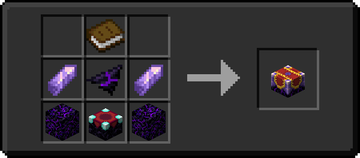

# Enchanting

## Major Changes
### [Redexed](https://modrinth.com/mod/redexed)
* Every enchantable item has a number of "slots" of enchantments that can be applied to it; For example, a diamond sword has 10 slots. This means you can have enchantment levels up to that number on the item, so you could have two level 5 enchantments, or five level 2 enchantments.
* When an item goes over its maximum enchantment level, it will become Overcharged. Overcharged items cannot be repaired (even with Mending or other repair enchants), and if an Overcharged item is Unbreakable, it's Unbreakable property will be overwritten. A grindstone can be used to remove the enchantments from the item, or, alternative, a curse can be applied to the item.
* Applying curses to your item will reduce the number of actively used enchantment slots by the level of the curse; so, for example, a diamond sword with Curse of Frozen Touch III functionally has 13 enchantment slots.

## Changes made to vanilla Enchantments
### [Enchancement](https://modrinth.com/mod/enchancement) & [Redexed](https://modrinth.com/mod/redexed)
* Lure is merged into Luck of the Sea.
* Protection enchantments are half as effective.
* Most vanilla enchantments have a new highest level of 5.
* Loyalty is base functionality for all tridents.
* Bane of Arthropods, Power, Protection, and Sharpness are disabled.
* Crossbows can utilize the Infinity enchant.
* Channeling smites in any weather. The lightning bolt does not create fire or destroy items. Melee attacks from a Channeling trident will work like Fire Aspect, igniting entities for 3 seconds. 

## New Mechanics
### [Illager Invasion](https://modrinth.com/mod/illager-invasion) & [Biome Makeover](https://modrinth.com/mod/biome-makeover)
* An enchant can be boosted over its maximum level by utilizing either an Imbuing Table or an Altar.
    * Altars (1) require Illunite Shards to work, and will randomly choose one enchantment on an item to increase the level of by one, at the cost of also applying a random curse to the item. Can only be used once per item.
    { .annotate }

        1.  

    * Imbuing Tables (1) require a Hallowed Gem and a copy of the book for the enchantment you want to boost. The book will be consumed in the process, and the item will be imbued with the enchantment at the next level. Can't boost enchantments already above their max level.
    { .annotate }

        1.  

### [Enchanting Infuser](https://modrinth.com/mod/enchanting-infuser)
* An Enchanting Infuser (1) is a block that allows you to pick and choose the enchantments you apply to your item. It requires bookshelves like an enchanting table.
{ .annotate }

    1.  

* An Advanced Enchanting Infuser (1) functions as an upgraded version of the Enchanting Infuser, being able to modify the enchantments of an item, so long as the item is at full durability. It can also repair items for an XP cost.
{ .annotate }

    1.  

### [Enchant the Rainbow](https://modrinth.com/mod/enchant-the-rainbow)
* Allows for Nether Stars to be split into Nether Star Fragments (1) which can be combined in an Anvil with a dye to dye the fragment. The dyed fragment can be applied to an enchanted item to change the color of the enchantment glint.
{ .annotate }

    1.  
{ .annotate }

    1.  